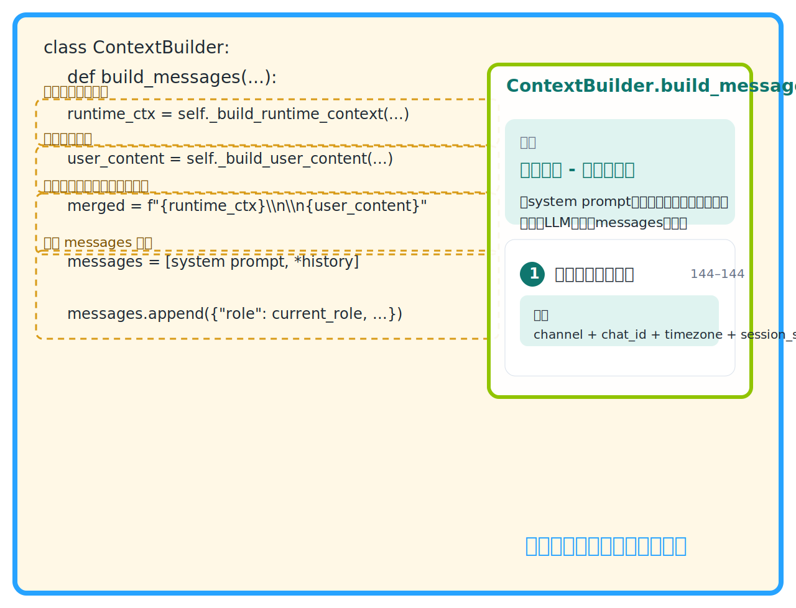

# Agent Code Learning

nanobot源码学习：https://guuumiho.github.io/agent-code-learning/

解决什么：

- 不知道先从哪个文件开始
- 不知道某个文件夹、文件、函数主要负责什么
- 不知道一段代码属于哪个 agent 功能
- 不知道跨文件流程怎么串起来
- 不知道“agent 是怎么跑起来的”，只能盯着实现细节发懵


### 左侧：项目地图

- 文件夹、文件、函数都有极短说明
- 重要函数会被突出
- 点击函数直接跳源码


### 中间：源码现场

- 展示真实源码
- 标出关键函数和关键代码块
- 悬浮板解释这段代码在当前 agent 流程里扮演什么角色



### 右侧：agent 基础知识

当前用 8 条场景来组织学习路径：

- 简单问答
- 上下文
- 工具调用
- MCP调用
- 记忆系统
- skills系统
- 状态调度
- 异常兜底

每一步里的函数名都可以点回源码。


## 怎么用

### 启动

双击：

```bat
start.bat
```

或手动运行：

```powershell
node .\server.js
```

打开：

```text
http://127.0.0.1:3939
```

### 分析方式

首次打开时，右上角 `设置` 默认展开。

你可以二选一：

- `GitHub`：直接分析公开仓库
- `本地`：分析你本机已下载的源码

### 历史分析

每次分析都会保存快照。  
之后可以在 `读取存档` 里切回旧结果，不需要重新消耗 token。

### 导出静态网站

把最近一次历史分析导出成可部署的静态网站：

```powershell
node .\scripts\export-static.js
```

生成目录：

```text
dist-site/
```

把 `dist-site/` 上传到服务器的 Nginx 网站目录即可。

## 缓存与隐私

缓存目录：

```text
.cache/source-atlas/
```

不会保存 API Key。
